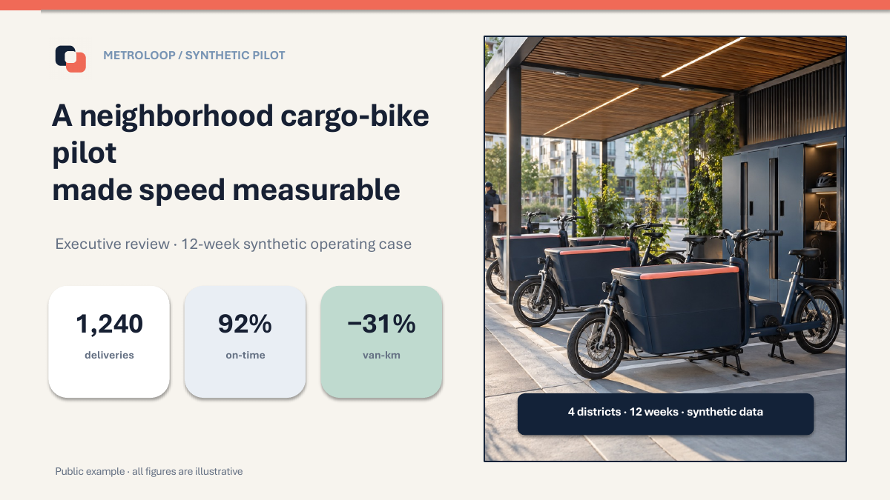
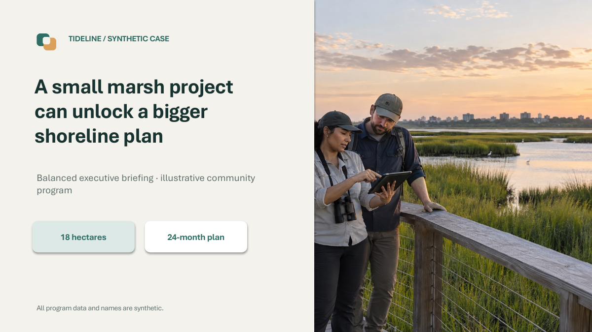

# agy-ppt

**Presentations without the AI look.**

Grounded enough to trust. Edited enough to present. Built to deliver.

**Language:** [繁體中文](README.md) | English

`agy-ppt` turns articles, reports, and source documents into hybrid PowerPoint decks: images preserve visual detail, while suitable text, native charts, and replaceable images remain editable. AGY owns the outline, design direction, content, and quality; specialized workers create visual assets before assembly into a `.pptx` with speaker notes.

🌐 [Website](https://sujunmin.github.io/agy-ppt/) · 🎨 [Examples](examples/README.md) · 🤝 [Contributing](CONTRIBUTING.md)

## Showcase

| Dense Executive | Balanced Executive |
| --- | --- |
|  |  |
| High-density storytelling with structured modules, native charts, and replaceable images for distinct purposes. | Clear hierarchy, moderate visual density, and editable PowerPoint elements. |

Both styles retain editable text, native charts where appropriate, and replaceable images; the product is not limited to one layout style. Explore the [reproducible examples](examples/README.md) for four-slide previews, prompts, outlines, style profiles, and asset provenance.

## Installation

Requirements: Python 3.11+, Git, and an authenticated agent environment with an available image-generation tool.

```bash
git clone https://github.com/sujunmin/agy-ppt.git
cd agy-ppt
python3 skills/agy-ppt/scripts/codex_ppt_runtime.py bootstrap
mkdir -p ~/.gemini/config/skills
rsync -a --delete ./skills/agy-ppt/ ~/.gemini/config/skills/agy-ppt/
```

`bootstrap` only creates the shared runtime and installs runtime dependencies. It does not run tests, OCR qualification, or sample-deck generation. Other agents can place `skills/agy-ppt/` in their supported workspace skill location.

## Basic Usage

Load the `agy-ppt` skill and tell AGY the topic, audience, length, and sources. For example:

```text
Turn this report into a 10-slide presentation for department leaders.
```

The default interactive flow asks you to:

1. Approve the outline
2. Approve the visual style
3. Review one real sample slide
4. Approve the sample, then generate the full deck

Changing the outline or style invalidates dependent sample approval. The full deck is never generated until all three approvals are current.

The visual style may explicitly opt into dense, card-based, image-rich layouts. This is an opt-in preference—the default remains balanced—and density is not inflated with duplicate images, shallow cards, or unsupported copy.

## How It Works

```text
User request / sources
  → Outline approval
  → Style approval
  → One-sample approval
  → Full deck
```

OCR-capable sources first produce traceable evidence for AGY:

```text
PDF / image → extraction / OCR evidence → source grounding → AGY
```

AGY remains the sole orchestrator and semantic authority. OCR and image workers cannot rewrite content or skip approval stages.

## Supported Inputs

- Markdown, plain text, DOCX, static HTML, and public remote content supported by the existing source system
- Searchable, scanned, and mixed PDFs
- PNG, JPEG, and single-frame TIFF

Multi-frame TIFF is rejected explicitly. OCR quality depends on the source, provider, and model.

## Documentation

- [Presentation approval workflow](skills/agy-ppt/docs/outline-style-and-sample.md)
- [Phase 16: grounded presentation planning and human editorial quality](skills/agy-ppt/docs/phase16-grounded-presentation-and-editorial-quality.md)
- [Phase 17: presentation intelligence and delivery quality](skills/agy-ppt/docs/phase17-presentation-intelligence-and-delivery-quality.md)
- [Phase 18: delivery fidelity, portability, and intelligent editability](skills/agy-ppt/docs/phase18-delivery-fidelity-portability-and-intelligent-editability.md)
- [Architecture and roles](skills/agy-ppt/docs/architecture-and-design-rationale.md)
- [Source acquisition, ingestion, and grounding](skills/agy-ppt/docs/source-ingestion.md)
- [OCR architecture and providers](skills/agy-ppt/docs/phase15-ocr-architecture.md)
- [Security, CI, and development testing](skills/agy-ppt/docs/ci-quality-gates.md)
- [Failure recovery](skills/agy-ppt/docs/recovery-testing.md)
- [Changelog](CHANGELOG.md)

Full developer test and release-qualification commands remain in the linked CI/testing documentation and are outside the normal user installation path.

## Contributing

Bug fixes, documentation, tests, presentation-quality and layout improvements, PowerPoint compatibility fixes, and new capabilities are welcome. Small focused PRs may be submitted directly; please open an issue or discussion first for changes to the product workflow, AGY semantic authority, frozen contracts, or major architecture. Visual changes must be reviewed through rendered output—passing unit tests alone does not establish presentation quality. See the [contribution guide](CONTRIBUTING.md).

## Project Status and License

The Phase 15 OCR/source-grounding pipeline, Phase 16 grounded-presentation and editorial-quality baseline, Phase 17 presentation-intelligence and delivery-quality baseline, and Phase 18 delivery-fidelity, portability, and intelligent-editability baseline are complete and frozen. Phase 18 produces hybrid PowerPoint presentations combining native text, shapes, charts, and replaceable images while strictly protecting evidence integrity and approved visual quality, providing practical editability for business-critical fields without claiming 100% native coverage, universal Office compatibility, perfect pixel equality, or universal font portability. Linux x86_64 is the primary production target, with hard-isolation validation still required in the deployment environment. macOS is development/API qualified; Windows is not production-security qualified. OCR JSON schemas remain deferred.

This project uses the [MIT License](LICENSE). It is derived from [`ningzimu/codex-ppt-skill`](https://github.com/ningzimu/codex-ppt-skill) and is not an official upstream release. See [`THIRD_PARTY_NOTICES.md`](THIRD_PARTY_NOTICES.md) for third-party notices.
