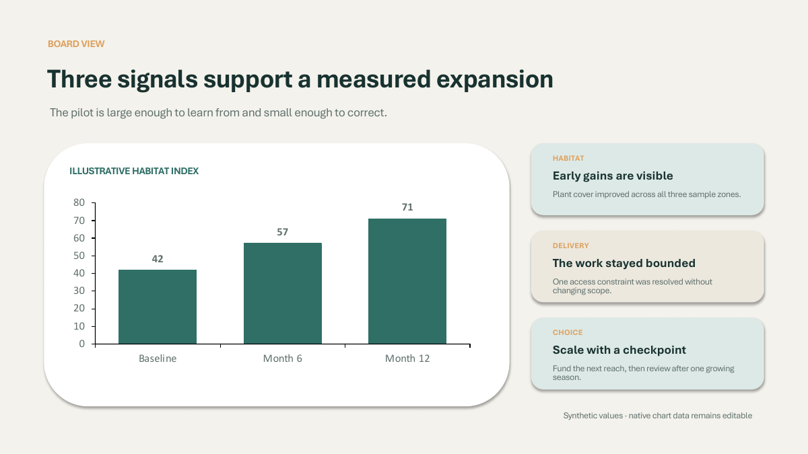
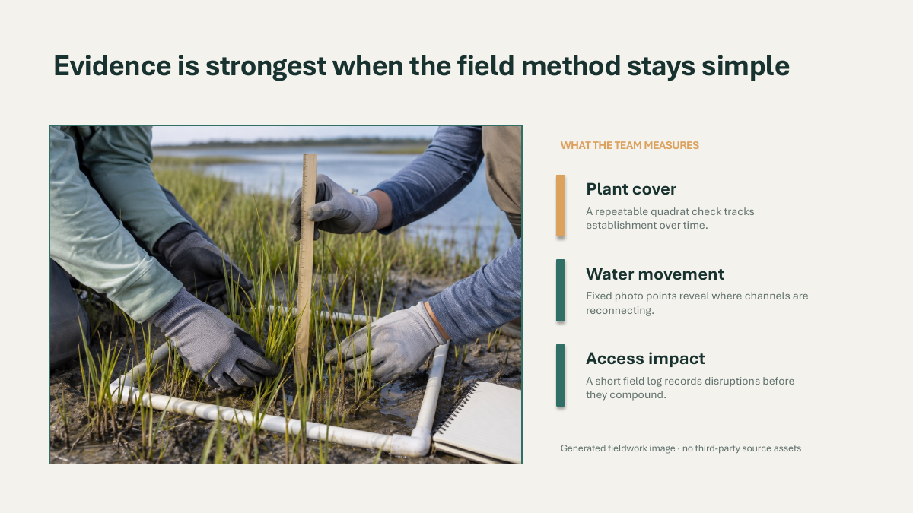
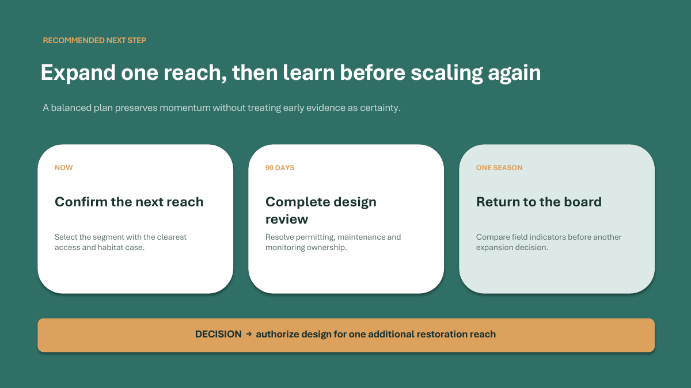

# Balanced Executive

## Goal

Show the repository's normal balanced style through a measured shoreline
restoration briefing with moderate imagery, a native chart, and a restrained
decision sequence.

## Prompt

See [prompt.md](prompt.md). The request describes a fictional community marsh
program and explicitly treats all values as synthetic.

## Style

See [style-profile.json](style-profile.json): balanced layout, medium card
density, and a moderate amount of purposeful imagery.

## Output

The four slides introduce the fictional shoreline plan, compare three
illustrative habitat-index readings, explain a simple field method, and close
with a staged expansion recommendation. One hero image establishes place; a
separate fieldwork image supports the measurement explanation.

| Slide 1 | Slide 2 |
| --- | --- |
|  |  |

| Slide 3 | Slide 4 |
| --- | --- |
|  |  |

## Editability

- **Editable:** headlines, captions, KPIs, cards, simple shapes, recommendation,
  and native chart data.
- **Replaceable:** the generated mark, shoreline hero image, and fieldwork
  image.
- **Fidelity-first:** photographic detail remains in independently replaceable
  image objects.

## Notes

Tideline and the program are fictional. The habitat-index values are synthetic,
not ecological measurements or evidence. Images were generated for this
repository without third-party references. See [asset provenance](assets/README.md).

The previews come from the actual PowerPoint-rendered PDF. A blank top-left
margin was cleaned of this machine's tenant-inserted information-protection
mark before publication; that mark is not part of the deck content.
