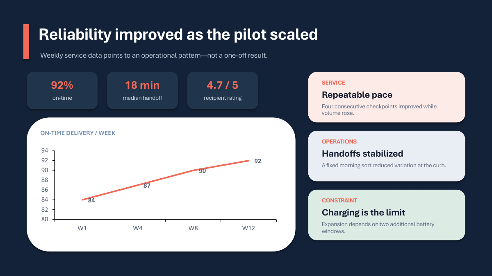
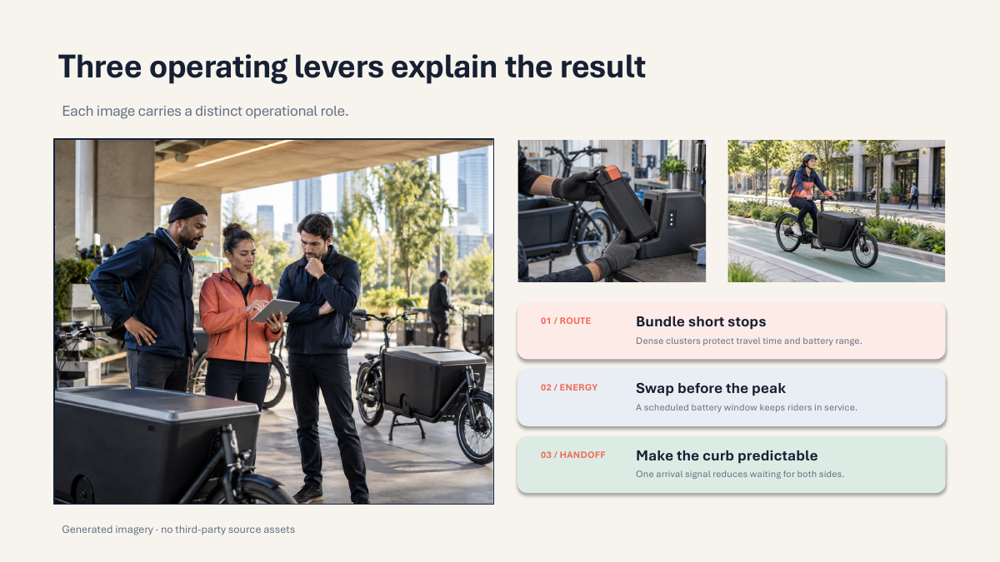
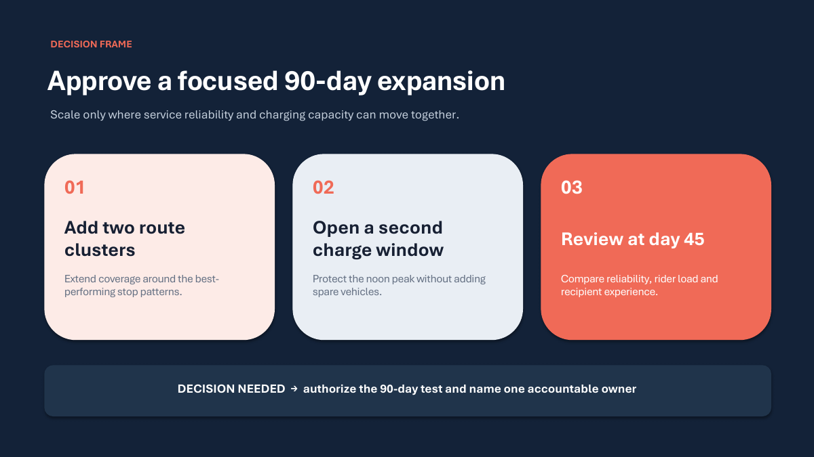

# Dense Executive

## Goal

Show how a high-density executive presentation can combine structured cards,
useful imagery, an editable chart, and a clear decision in four slides.

## Prompt

See [prompt.md](prompt.md). The request asks for a fictional 12-week urban
cargo-bike pilot review. All operating figures are illustrative.

## Style

See [style-profile.json](style-profile.json): dense layout, high card density,
image-rich visual treatment, and high semantic density.

## Output

The deck moves from a pilot cover and KPI row to a native weekly reliability
chart, three operational levers supported by distinct images, and a three-step
expansion decision. The images show the operating context, battery handling,
and route execution; none is a duplicate crop.

| Slide 1 | Slide 2 |
| --- | --- |
|  |  |

| Slide 3 | Slide 4 |
| --- | --- |
|  |  |

## Editability

- **Editable:** headlines, labels, KPIs, decision copy, cards, simple shapes,
  and native chart data.
- **Replaceable:** the generated mark and each of the four independent photos.
- **Fidelity-first:** the photos remain image objects; their photographic
  detail is not converted into editable shapes.

## Notes

MetroLoop is fictional. Every number is synthetic and is not business evidence.
Images were generated specifically for this repository example without
third-party reference assets. See [asset provenance](assets/README.md).

The previews come from the actual PowerPoint-rendered PDF. A blank top-left
margin was cleaned of this machine's tenant-inserted information-protection
mark before publication; that mark is not part of the deck content.
